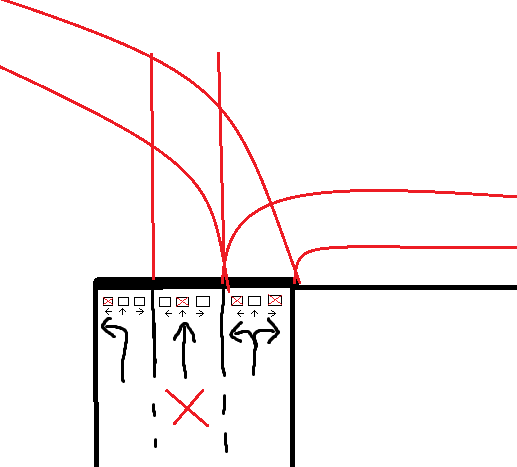
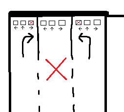
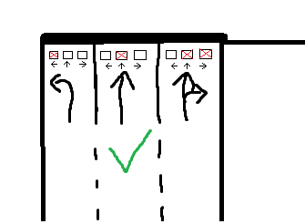
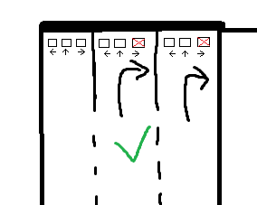

# Analýza projektu: Simulácia križovatky so semaformi

## 1. Základná charakteristika systému

Simulácia sa zameriava na riadenie dopravy na klasickej križovatke v tvare **+ (4 cesty)**. Zohľadňuje len **motorové vozidlá**, bez chodcov, cyklistov, priechodov atď. Uvažujeme bez otáčania vozidiel v križovatke.

Simulácia počíta so štyrmi smermi (vetvami): **Sever, Juh, Východ, Západ**. Všetky štyri smery majú **3** jazdné pruhy (nie všetky musia byť aktívne).

Aplikácia funguje na princípe 2 typov správ, kedy používateľ najprv vytvorí križovatku, teda nastavenia jazdných pruhov pomocou checkoxov. 
Keď je vytvorená križovatka, následne nastavuje, kedy majú semafory zobrazovať signál Voľno.


## 2. Nastavenie pruhov
Používateľ môže pomocou checkboxov pre každý pruh zvoliť, akým smerom tento pruh pokračuje.
Je možné v jazdnom pruhu nevybrať žiaden povolený smer jazdy - v takomto prípade sa tento pruh nepoužíva. 
   → Jazdný pruh, v ktorom je zvolený v checkboxe aspoň 1 smer budeme označovať ako **Aktívny pruh**.


Základným obmedzením je, že **2 susedné aktívne pruhy** sa nemôžu križovať. 

**Tabuľka zakázaných konfigurácií 2 susedných aktívnych pruhov:**
| Ľavý pruh | Pravý pruh |
|-----------|------------|
|↑|←|
|→|←|
|→|↑|








## 3.1. Semafory

Používajú sa len semafory so smerovými signálmi, čo znamená, že vozidlá nedávajú nikomu prednosť, križovanie voľných smerov je neprípustné.
→ Neuvažujeme s oranžovým signálom.
→ Semafor (a teda aj signál na ňom) sa vždy vzťahuje k jazdným jednotlivým aktívnym pruhom.


## 3.2. Nastavenie fáz semaforov
→ Používateľ nastavuje pre každý jazdný pruh práve jeden časový interval (fáza) v sekundách, kedy je na tomto semafore rozsvietená zelená → keď nesvieti zelená, svieti červená.
→ Križovatku riadi cyklus, ktorý sa opakuje.
→ Dĺžka cyklu je automaticky vypočítaná z najvačšej hodnoty konca signálu voľno v rámci celej križovatky.


## 3.3. Zakázané fázové kombinácie
→ Fázy musia byť nastavené tak, aby počas simulácie nedošlo ku kolízií - križovaniu voľných smerov.
→ Počas celého cyklu nesmú byť nastavené nasledovné kombinácie na ktoromkoľvek z pruhov celej križovatke:
| Voľno  <br> (v ktoromkoľvek z pruhov) | Obmedzenia       |
|---------|------------------|
|↑        | - náprotivná vetva nesmie mať voľno vľavo<br> - vetva po pravej strane nesmie mať voľno v žiadnom smere<br> - vetva po ľavej strane nesmie mať voľno vľavo alebo priamo|
|←        | - náprotivná vetva nesmie mať voľno vpravo alebo priamo<br> - vetva po pravej strane nesmie mať voľno priamo alebo vľavo<br> - vetva po ľavej strane nesmie mať voľno vľavo alebo priamo|
|→        | - náprotivná vetva nesmie mať voľno vľavo<br> -vetva po ľavej strane nesmie mať voľno priamo|


## 4. Komunikácia frontend – backend – simulácia

Frontend a backend komunikujú prostredníctvom dvoch hlavných JSON správ:

---

#### 1. Správa: Vytvorenie križovatky (definícia pruhov)

Táto správa sa odošle po nakonfigurovaní pruhov pomocou checkboxov.

#### Štruktúra:
```json
{
  "intersection": {
    "north": [ "left", "straight", "right" ],
    "south": [ "left", "straight" ],
    "east": [],
    "west": [ "straight", "right" ]
  }
}
```

#### 2. Správa: Nastavenie fáz semaforov
Odosiela sa po zadefinovaní časov, kedy majú pruhy zelenú.

Štruktúra:
```json
{
  "phases": {
    "north": {
      "left":   { "start": 0,  "end": 5 },
      "straight": { "start": 6,  "end": 10 },
      "right":  { "start": 0,  "end": 10 }
    },
    "south": {
      "left":   { "start": 5,  "end": 10 }
    },
    "east": {
      "straight": { "start": 11, "end": 20 }
    },
    "west": {}
  }
}
```